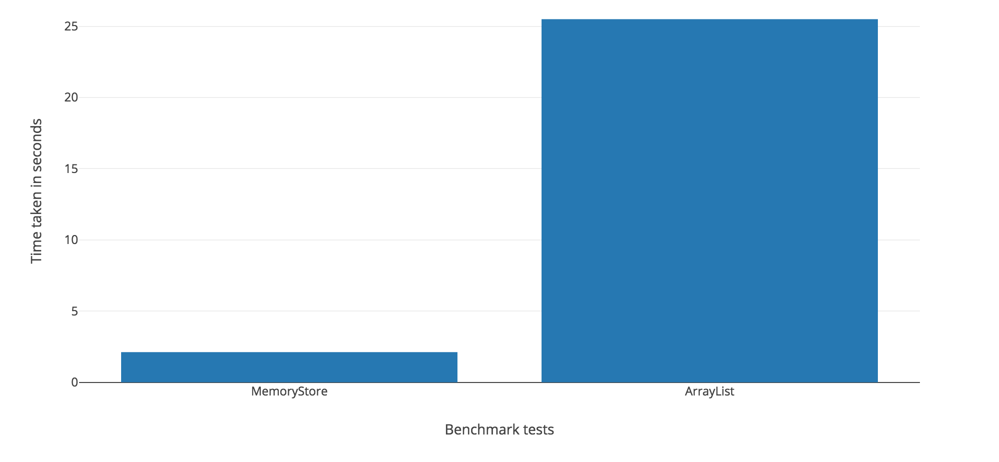

# Data Store

[](https://maven-badges.herokuapp.com/maven-central/com.jparams/data-store)
 [](https://travis-ci.org/jparams/data-store)

## Getting Started

### Get Data Store

Maven:
```
<dependency>
    <groupId>com.jparams</groupId>
    <artifactId>data-store</artifactId>
    <version>2.x.x</version>
</dependency>
```

Gradle:
```
compile 'com.jparams:data-store:2.x.x'
```

### What is Data Store?
Data Store is a full-featured indexed Java Collection capable of ultra-fast data lookup. But don't take my word for it, run the [benchmark](src/test/java/com/jparams/store/memory/MemoryStoreBenchmarkTest.java) yourself!

Here is one I ran earlier...



Fast, huh!

So how does it work? Well, Data Store, or “Store” for short, builds on top of java.util.Collection, providing a standard interface for adding, removing and iterating elements. This is where other implementation of java.util.Collection stop, but Data Store does a lot more. Data Store provides the ability to add multiple indexes on the elements stored in the collection. The indexing adds a slight overhead when adding elements into the collection, but makes element lookup ridiculously quick.

Whilst indexing is the key functionality we are trying to promote with this library, we have made an effort to ensure that Data Store is a delight to use. Do you need a synchronized Data Store for your multi-threaded environment? How about an unmodifiable view of your Data Store? Maybe you just want to copy an existing Data Store quickly and easily? You can do all this and more!

### Create a Data Store
Creating a Data Store is easy!

```java
Store<Person> store = new MemoryStore<>();
```

There we go, a shiny new Store has been created. Go ahead and use this as you would any other implementation of java.util.Collection. Add, remove, clear.. all the usual methods.

In case you were wondering, MemoryStore is the default implementation of the Store interface. It is a "Memory" Store because it holds all elements added to the Store in memory.

### Using a Data Store
Lets go ahead and use our Store. Here is some of the cool stuff you can do!

#### Indexing
Index your Store and enable ultra-fast data lookup. It is as simple as calling the `addIndex` method. Here goes.....

```java
store.addIndex("firstName", Person::getFirstName);
```

Easy, right?! With our index created, lets query some data and lets query them fast!

```java
List<Person> result1 = store.get("firstName", "James");
```

Data Store is backed by hash maps, so this lookup is quick. No looping required.

#### Comparison Policy
Lets build on top of the already powerful indexing feature by introducing Comparison Policies. These policies define how indexes are created and how they are matched.

##### Case Insensitive Comparison Policy
Use this policy for creating case insensitive indexes. Example:

```java
// Create a store
Store<Person> store = new MemoryStore<>();

// Add a case insensitive index
Index<Person> index = store.addIndex(Person::getFirstName, new CaseInsensitiveComparisonPolicy());

// Query index - these will produce the same result
index.get("James");
index.get("JAMES");
index.get("james");
index.get("JAMes");
```

##### Normalized Offset Date Time Comparison Policy
Comparison policy for comparing two OffsetDateTime values normalized to an UTC time offset.

```java
// Create a store
Store<Person> store = new MemoryStore<>();

// Add a case insensitive index
Index<Person> index = store.addIndex(Person::getLastActive, new NormalizedOffsetDateTimeComparisonPolicy());

// Query index - these will produce the same result
index.get(OffsetDateTime.of(LocalDateTime.of(2018, 5, 5, 13, 55, 30), ZoneOffset.ofHours(2)));
index.get(OffsetDateTime.of(LocalDateTime.of(2018, 5, 5, 14, 55, 30), ZoneOffset.ofHours(3)));
index.get(OffsetDateTime.of(LocalDateTime.of(2018, 5, 5, 15, 55, 30), ZoneOffset.ofHours(4)));
```

##### Normalized Zoned Date Time Comparison Policy
Comparison policy for comparing two ZonedDateTime values normalized to an UTC timezone.

```java
// Create a store
Store<Person> store = new MemoryStore<>();

// Add a case insensitive index
Index<Person> index = store.addIndex(Person::getLastActive, new NormalizedZonedDateTimeComparisonPolicy());

// Query index - these will produce the same result
index.get(LocalDateTime.of(2018, 5, 5, 13, 55, 30).atZone(ZoneId.of("Europe/London")));
index.get(LocalDateTime.of(2018, 5, 5, 12, 55, 30).atZone(ZoneId.of("UTC")));
```

## Compatibility
This library is compatible with Java 8 and above.

## License
[MIT License](http://www.opensource.org/licenses/mit-license.php)

Copyright 2017 JParams

Permission is hereby granted, free of charge, to any person obtaining a copy of this software and associated documentation files (the "Software"), to deal in the Software without restriction, including without limitation the rights to use, copy, modify, merge, publish, distribute, sublicense, and/or sell copies of the Software, and to permit persons to whom the Software is furnished to do so, subject to the following conditions:

The above copyright notice and this permission notice shall be included in all copies or substantial portions of the Software.

THE SOFTWARE IS PROVIDED "AS IS", WITHOUT WARRANTY OF ANY KIND, EXPRESS OR IMPLIED, INCLUDING BUT NOT LIMITED TO THE WARRANTIES OF MERCHANTABILITY, FITNESS FOR A PARTICULAR PURPOSE AND NONINFRINGEMENT. IN NO EVENT SHALL THE AUTHORS OR COPYRIGHT HOLDERS BE LIABLE FOR ANY CLAIM, DAMAGES OR OTHER LIABILITY, WHETHER IN AN ACTION OF CONTRACT, TORT OR OTHERWISE, ARISING FROM, OUT OF OR IN CONNECTION WITH THE SOFTWARE OR THE USE OR OTHER DEALINGS IN THE SOFTWARE.
